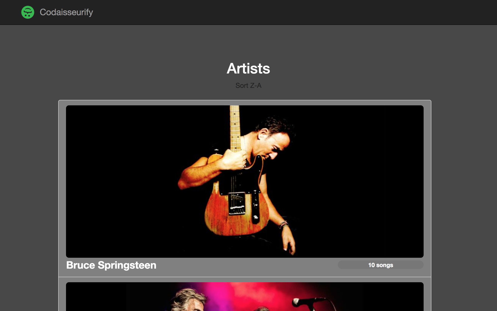
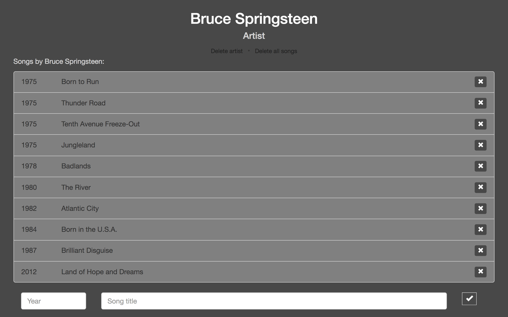

# Codaisseurify

Simple Rails app made following week 3 of the 9-week Codaisseur Academy.

### Assignment
Create an app in charge of managing a collection of songs and their associated artists, using Rails and PostgreSQL. Adding and removing songs must be done via AJAX - DOM manipulation.

#### Requirements:
- Artists overview page with image for each artist.
- Artist show page with a list of songs. A song can be added/deleted or all songs can be deleted.
- An artist can be deleted. All associated songs must be deleted.
- Include model tests and integration tests (for adding/removing).




## Steps

While working on this app I followed these steps:

1. Setting up project with Rails and PostgreSQL.
2. Adding Bootstrap, jQuery, Devise, RSpec, FactoryBot.
3. Creating models and associations.
4. Setting up controllers.
5. Adding views.
6. Add song add/delete feature.
7. Delete artist with all associated songs.
8. Convert add/delete features to AJAX.

## Database Structure

#### Artists
  * name:string
  * description:text
  * artist_type:string
  * image:string

#### Songs
  * name:string
  * year:integer
  * artist_id:bigint


## Running Locally

Make sure you have [Ruby](https://www.ruby-lang.org/en/) and [Bundler](http://bundler.io/) installed.

```bash
git clone git@github.com:Abohte/codaisseurify.git
cd codaisseurify
bundle install
rails db:create db:migrate db:seed
rails server
```
